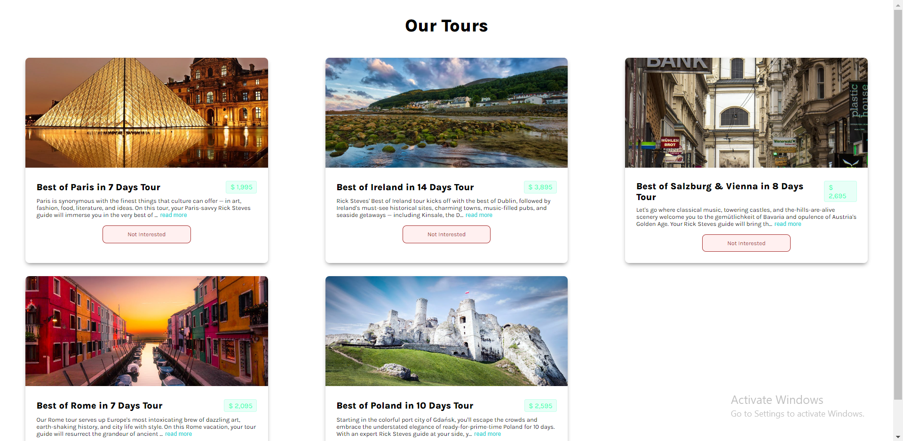

# Places To Visit

### React App

Travel and tourism guides. Many websites take the form of a digital version of a traditional guide book, aiming to provide advice on which destinations, attractions, accommodations, and so on, are worth a visit and providing information on how to access them.

### App Components

1. Generative Card
2. Destroy buttons
3. Closeable text

### Web Page

